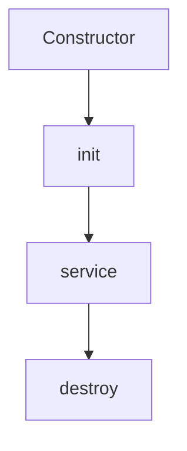

# 🌐 Java Servlet – Complete Notes

A **Servlet** is a Java class used to extend the capabilities of servers. Typically used for handling HTTP requests in web applications.

---

## 🧠 What is a Servlet?

- A Java class that responds to client requests
- Runs on a web server or servlet container (like Tomcat)
- Follows **Java EE** standards
- Handles both GET and POST requests
- Stateless by default (uses sessions for state management)

---

## 🔄 Servlet Lifecycle

| Phase            | Method                           | Description                                           |
|------------------|----------------------------------|-------------------------------------------------------|
| Loading          | `Constructor`                    | Servlet class is loaded and instance is created       |
| Initialization   | `init(ServletConfig config)`     | Called once when servlet is first loaded              |
| Request Handling | `service(HttpServletRequest req, HttpServletResponse res)` | Called for every request            |
| Destruction      | `destroy()`                      | Called once before servlet is destroyed               |

---

## 🔁 Lifecycle Diagram
## 🔄 Servlet Lifecycle Diagram



---

## 🧪 Servlet Example

### ✏️ HelloServlet.java
```java
import java.io.*;
import javax.servlet.*;
import javax.servlet.http.*;

public class HelloServlet extends HttpServlet {
    
    // Initialization method
    public void init() throws ServletException {
        System.out.println("Servlet Initialized");
    }

    // GET request handler
    public void doGet(HttpServletRequest request, HttpServletResponse response)
            throws ServletException, IOException {
        response.setContentType("text/html");
        PrintWriter out = response.getWriter();
        out.println("<html><body>");
        out.println("<h1>Hello from Servlet</h1>");
        out.println("</body></html>");
    }

    // POST request handler
    public void doPost(HttpServletRequest request, HttpServletResponse response)
            throws ServletException, IOException {
        doGet(request, response);
    }

    // Cleanup method
    public void destroy() {
        System.out.println("Servlet Destroyed");
    }
}
